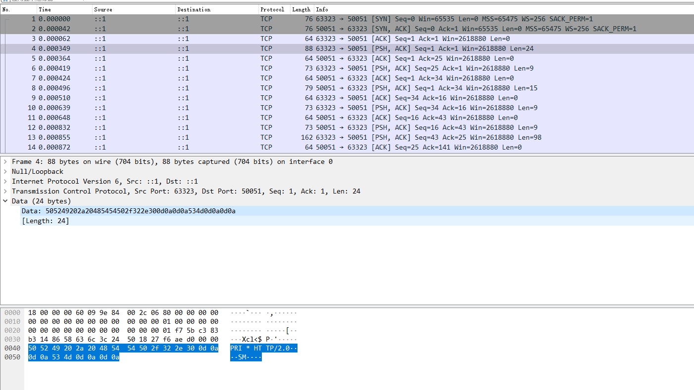

# Golang gRPC: 基于CA证书的双向TLS认证

在上一篇文章[Golang 学习之 grpc 的使用](https://blog.csdn.net/weixin_41335923/article/details/124115585)中介绍了 gRPC 的使用，并使用官方 example 来举例解读

在这里先看一下对 gRPC 的传输抓包


可以看到 gRPC Client/Server 都是明文加密的；在真实场景中，就会有可能被第三方恶意篡改或伪造 "非法" 数据，因此我们需要对 gRPC 进行加密传输处理

Golang 提供了两种加密示例 ATLS 和 TLS，笔者使用的是双向 TLS (mTLS)，客户端和服务端相互验证

## ATLS

ATLS 目前需要 GCP 的特殊早期访问权限

ATLS 是谷歌的应用层传输安全，支持相互认证和传输加密；但目前 ATLS 之支持在 Google Cloud Platform 上运行；与 TLS 不同，ATLS 的证书/密钥管理对用户透明，更容易设置

## TLS

TLS 是一种常用的加密协议，用于提供端到端的通信安全性。

在正常的 TLS 中，服务器只关心提供服务器证书供客户端验证；在双向 TLS 中，服务器还加载受信任的 CA 文件列表，用于验证客户端提供的证书
在普通的 TLS 中，客户端只关心使用一个或多个受信任的 CA 文件对服务器进行身份验证；在双向 TLS 中，客户端还将客户端证书提供给服务器进行身份验证

## 代码剖析

这里分析一下 mTLS 模式的 gRPC 代码，有关证书的生成可以参考 [带入gRPC：基于 CA 的 TLS 证书认证](https://segmentfault.com/a/1190000016601810) 或者 官方的脚本生成 [create.sh](https://github.com/grpc/grpc-go/blob/master/examples/data/x509/create.sh)

### Server

```go
package main

import (
	"context"
	"crypto/tls"
	"crypto/x509"
	"flag"
	"fmt"
	"io/ioutil"
	"log"
	"net"

	pb "go-grpc-CA/proto"

	"google.golang.org/grpc"
	"google.golang.org/grpc/credentials"
)

var port = flag.Int("port", 50051, "the port to serve on")

type ecServer struct {
	pb.UnimplementedEchoServer
}

func (s *ecServer) UnaryEcho(ctx context.Context, req *pb.EchoRequest) (*pb.EchoResponse, error) {
	return &pb.EchoResponse{Message: req.Message}, nil
}

func main() {
	flag.Parse()
	log.Printf("server starting on port %d...\n", *port)

	cert, err := tls.LoadX509KeyPair("../conf/server_cert.pem", "../conf/server_key.pem")
	if err != nil {
		log.Fatalf("failed to load key pair: %s", err)
	}

	ca := x509.NewCertPool()
	caFilePath := "../conf/client_ca_cert.pem"
	caBytes, err := ioutil.ReadFile(caFilePath)
	if err != nil {
		log.Fatalf("failed to read ca cert %q: %v", caFilePath, err)
	}
	if ok := ca.AppendCertsFromPEM(caBytes); !ok {
		log.Fatalf("failed to parse %q", caFilePath)
	}

	tlsConfig := &tls.Config{
		ClientAuth:   tls.RequireAndVerifyClientCert,
		Certificates: []tls.Certificate{cert},
		ClientCAs:    ca,
	}

	s := grpc.NewServer(grpc.Creds(credentials.NewTLS(tlsConfig)))
	pb.RegisterEchoServer(s, &ecServer{})
	lis, err := net.Listen("tcp", fmt.Sprintf("localhost:%d", *port))
	if err != nil {
		log.Fatalf("failed to listen: %v", err)
	}
	if err := s.Serve(lis); err != nil {
		log.Fatalf("failed to serve: %v", err)
	}
}
```

### Client

```go
package main

import (
	"context"
	"crypto/tls"
	"crypto/x509"
	"flag"
	"fmt"
	"io/ioutil"
	"log"
	"time"

	ecpb "go-grpc-CA/proto"

	"google.golang.org/grpc"
	"google.golang.org/grpc/credentials"
)

var addr = flag.String("addr", "localhost:50051", "the address to connect to")

func callUnaryEcho(client ecpb.EchoClient, message string) {
	ctx, cancel := context.WithTimeout(context.Background(), 10*time.Second)
	defer cancel()
	resp, err := client.UnaryEcho(ctx, &ecpb.EchoRequest{Message: message})
	if err != nil {
		log.Fatalf("client.UnaryEcho(_) = _, %v: ", err)
	}
	fmt.Println("UnaryEcho: ", resp.Message)
}

func main() {
	flag.Parse()

	cert, err := tls.LoadX509KeyPair("../conf/client_cert.pem", "../conf/client_key.pem")
	if err != nil {
		log.Fatalf("failed to load client cert: %v", err)
	}

	ca := x509.NewCertPool()
	caFilePath := "../conf/ca_cert.pem"
	caBytes, err := ioutil.ReadFile(caFilePath)
	if err != nil {
		log.Fatalf("failed to read ca cert %q: %v", caFilePath, err)
	}
	if ok := ca.AppendCertsFromPEM(caBytes); !ok {
		log.Fatalf("failed to parse %q", caFilePath)
	}

	tlsConfig := &tls.Config{
		ServerName:   "x.test.example.com",
		Certificates: []tls.Certificate{cert},
		RootCAs:      ca,
	}

	conn, err := grpc.Dial(*addr, grpc.WithTransportCredentials(credentials.NewTLS(tlsConfig)))
	if err != nil {
		log.Fatalf("did not connect: %v", err)
	}
	defer conn.Close()

	callUnaryEcho(ecpb.NewEchoClient(conn), "hello world")
}
```

## 代码地址
https://github.com/MoGD2018/go-study/tree/main/go-grpc-CA

## 参考
[1] [带入gRPC：基于 CA 的 TLS 证书认证](https://segmentfault.com/a/1190000016601810)